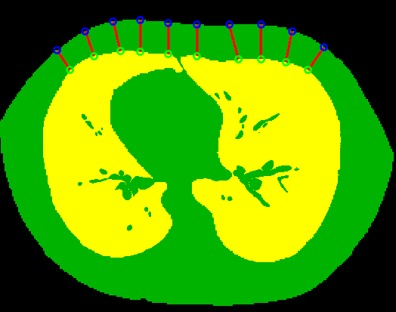
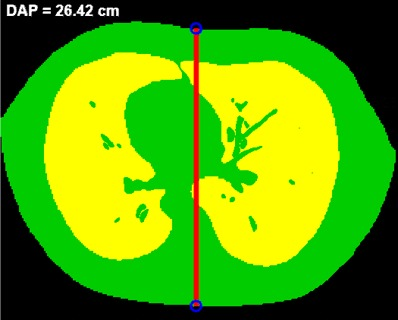

# moroccan-digital-voxelized-thoracic-phantoms---UH1-ISSS
Development of voxelized digital thoracic phantoms representative of the Moroccan population using CT images., 3D Slicer, MONAI auto3dseg, Lung GMM , TotalSegmentator and MATLAB.
# Moroccan Digital Voxelized Thoracic Phantoms

## Description

This project focuses on the development of voxelized digital thoracic phantoms representative of the Moroccan population using CT images.

The study includes three groups:
- Moroccan adult male
- Moroccan adult female
- Moroccan child

The workflow is based on CT image processing, automatic segmentation, manual correction, morphometric analysis, and multicriteria selection of representative thoracic phantoms.

## Tools and Software

- 3D Slicer
- TotalSegmentator
- MONAI Auto3DSeg
- Lung CT GMM
- MATLAB
- Microsoft Excel

## Methodology

The main steps of the project are:

1. Importation of thoracic CT images
2. Automatic segmentation using AI-based tools
3. Manual correction of segmented structures
4. Export of voxelized labelmaps
5. Calculation of morphometric parameters:
   - Lung volume
   - Chest Wall Thickness
     
   - Anteroposterior diameter
     
6. Comparison of segmentation methods
7. Multicriteria selection of representative phantoms

## Segmented Structures

For male and child phantoms:

| Label | Structure |
|---|---|
| 1 | Lungs |
| 2 | Body |
| 3 | Bones |

For female phantom:

| Label | Structure |
|---|---|
| 1 | Lungs |
| 2 | Body |
| 3 | Breasts |
| 4 | Bones |

## Representative Phantoms

The final selected representative phantoms are:

| Group | Selected Patient |
|---|---|
| Male | H5 |
| Female | F8 |
| Child | E3 |
 
## Privacy Statement

Original CT images and patient data are not included in this repository due to medical confidentiality and patient privacy.

Only anonymized results, scripts, figures, and methodological documents are shared.

## Author

Ossama AABI  
ISSS Settat - Université Hassan 1er
